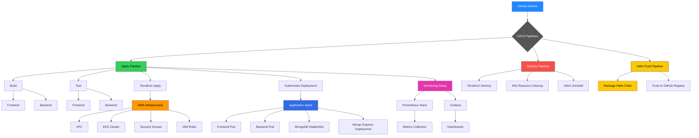

# 🎓 Grad Project Deployment – Full DevOps Pipeline on AWS


## 🚀 Project Overview

This is a comprehensive full-stack DevOps project developed as a graduation project. It demonstrates the use of Infrastructure as Code (IaC), Continuous Integration and Deployment (CI/CD), containerization, Helm-based application management, and Kubernetes-based orchestration deployed to AWS using EKS.

The stack includes:
- **Next.js frontend**
- **Node.js backend**
- **MongoDB & Mongo Express database**
All wrapped in Docker containers and deployed via Helm charts to an EKS Kubernetes cluster.

---

## 📐 Architecture Overview



---

## 🧾 Key Features

- **CI/CD** with GitHub Actions
- **Terraform IaC** for AWS EKS, VPC, IAM, etc.
- **Docker** containers for frontend/backend/Mongo
- **Helm Charts** for K8s management
- **Ingress & NodePort** service exposure
- **GitHub Secrets** for secure token handling
- **Monitoring** via Prometheus & Grafana (optional)

---

## 🗂️ Project Structure

```
grad_project-deployment/
├── Terraform/                  # Modular Terraform setup
│   ├── VPC_Module/
│   ├── EKS_Module/
│   ├── NodeGroup_Module/
│   ├── EC2_Module/
│   └── SecurityGroup_Module/
├── .github/workflows/         # GitHub Actions for CI/CD
├── app/                       # Helm chart (all app components)
├── kubernetes/                # Raw YAMLs (alternative deployment)
├── herafy-back-end/           # Node.js + MongoDB backend
├── herafy-client/             # Next.js frontend app
└── docker-compose.yml         # For local testing
```

---

## 🛠️ How to Execute

### 1. Clone the Repository

```bash
git clone https://github.com/your-user/grad_project-deployment.git
cd grad_project-deployment
```

---

### 2. Provision Infrastructure with Terraform

```bash
cd Terraform
terraform init
terraform apply
```

> Make sure AWS credentials are configured via CLI or environment.

---

### 3. Deploy Helm Chart to EKS

```bash
helm upgrade --install my-full-app ./app -f ./app/values.yaml
```

---

### 4. CI/CD with GitHub Actions

Push changes to the `deployment` branch to trigger workflows:
- `ci.yml` – Build, test
- `helm-publish.yml` – Package and push Helm chart
- `destroy.yml` – Destroy infrastructure

#### Required Secrets:
- `AWS_ACCESS_KEY_ID`
- `AWS_SECRET_ACCESS_KEY`
- `GITHUB_TOKEN`

---

### 5. Local Development with Docker Compose

```bash
docker-compose up --build
```

---

## 🧰 Technologies Used

- Terraform
- AWS (EKS, VPC, IAM, EC2)
- Kubernetes & Helm
- Docker & Compose
- GitHub Actions
- Node.js (Backend)
- Next.js (Frontend)
- MongoDB + Mongo Express
- Prometheus + Grafana (optional)

---

## 📎 Notes

- Ensure you have `kubectl`, `aws-cli`, `terraform`, `docker`, and `helm` installed.
- Customize `.env` and `values.yaml` as needed.

---